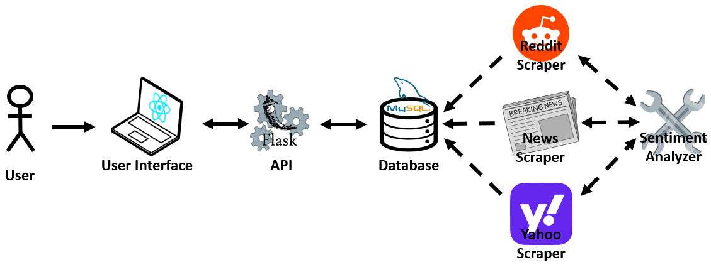
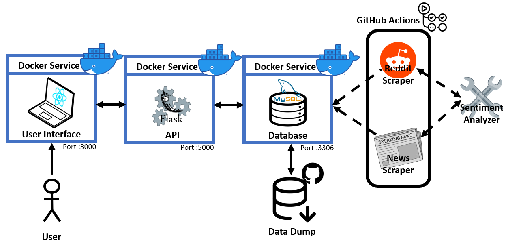

# Market Sentiment Analyzer Tool

Introducing our innovative project, a **Stock Market Sentiment Analyzer Tool**, developed by **Hugo Paré (#300173735)** and **Jayden Bergevin (#300173747)** for our Capstone project in the **SEG4910-4911 class**. The mission of the **"Sheep Indicator"** is to offer valuable insight to investors aiming to decode the market sentiments efficiently.

# Table of contents
* [Installation Guide](#installation-guide)
* [Architecture](#architecture)
  * [Scraping APIs](/scrapers/README.md)
  * [Sentiment Analyzer](/vaderSentiment/README.md)
  * [Database](/db/README.md)
  * [API](/api/README.md)
  * [User Interface](/ui/README.md)
* [Deployment](#deployment)
* [Quality Assurance](/tests/README.md)
* [Troubleshooting](#troubleshooting)
  * [Issues with local deployment](#issues-with-local-deployment)
  * [Issues with Docker services](#issues-with-docker-services)
  * [Issues with MySQL](#issues-with-mysql)

# Installation Guide

These steps are based on an Ubuntu environment but should work similarly on other systems that support Docker.

To run the project locally, follow these steps:

### Clone the repository

Run the following commands:

```bash
git clone <repository-url>
cd <repository-folder>
```

### Export Environment Variables

A `.env` file with all environment variables is necessary to run the application. Once placing the `.env` file in the main directory, run the following command:

```bash
source .env
```

### Start the services with Docker

Run the following command to initialize the entire system, including the user interface and backend:

```bash
docker compose up -d
```

### Access the User Interface

Once the services are running, the React UI will be available at http://localhost:3000

# Architecture

This architecture diagram provides a high-level view of how the different components in the system interact with each other. Each part of the architecture will be explained in more detail in the following sections:
* **React User Interface**: The front-end of the application is built with React, it serves as the user interface and sends requests to the Flask API
* **Flask API**: The Flask API acts as the backend, handling requests from the React UI, it processes the data, interacts with the database, and returns the sentiment of the requested company
* **MySQL Database**: All data is stored and managed in a MySQL database, the database is updated regularly by scrapers
* **Scrapers**: The scrapers gather News, Reddit and Yahoo data for sentiment analysis relevant to specific stock tickers or companies, which are then stored in the database
* **Sentiment Analyzer**: The Sentiment Analyzer processes the gathered data and user input, analyzing the text to determine the sentiment score, which reflects the overall tone of the input.

**Architecture diagram:**



# Deployment

This deployment diagram illustrates the following key components:
* **User Interface (React)**: A user interface built with React that communicated with the backend API
* **Selenium**: Performs automated browser testing to ensure UI functionality
* **API (Flask)**: A Flask API that processes requests from the UI and interacts with the database
* **Locust**: Implements load testing simulations to evaluate the application's performance under various user loads
* **Database (MySQL)**: Stores the data processed by the scrapers
* **GitHub Actions**: A CI/CD pipeline responsible for running unit tests on the database and scrapers and also updating the database periodically
* **Docker**: The services are encapsulated within a Docker container to ensure consistent deployment across environment
* **Sentiment Analyzer**: Analyzes text data (comments, news) and returns a sentiment score
* **Data Dump**: `.sql` files stored in the GitHub repo, used to populate the database with pre-saved data during initialization

**Deployment diagram:**



# Troubleshooting

## Issues with local deployment

If the installation guide did not resolve the issue, you may need to obtain specific credentials and set environment variables. These credentials are required to properly launch the application. Please contact Hugo Paré (hpare040@uottawa.ca) for the credentials.

Once you have the credentials, export the necessary environment variables like so:

```bash
export <VARIABLE_NAME>=<VALUE>
```

## Issues with Docker services

If running docker compose up -d fails, you can troubleshoot by inspecting the status of the Docker containers. Use the following command to check:
```bash
docker ps
```

You should see output similar to this:
```bash
CONTAINER ID   IMAGE          COMMAND                  CREATED         STATUS         PORTS                                                    NAMES
84ed9f55ce95   python:3.9     "sh -c 'pip install …"   6 seconds ago   Up 5 seconds   0.0.0.0:5000->5000/tcp, :::5000->5000/tcp                api
f4c5629d9bf9   node:14        "docker-entrypoint.s…"   6 seconds ago   Up 5 seconds   0.0.0.0:3000->3000/tcp, :::3000->3000/tcp                react-ui
da82b19e4966   mysql:latest   "docker-entrypoint.s…"   6 seconds ago   Up 5 seconds   33060/tcp, 0.0.0.0:3307->3306/tcp, [::]:3307->3306/tcp   mysql-db
```

If a container is not running as expected, you can check its logs using:
```bash
docker logs <container_name>
```

## Issues with MySQL

If you encounter issues with MySQL, you will need to verify that the database is running correctly. Use the following command to check the databases:
```bash
docker exec mysql-db mysql -h mysql -u root -p<password> -e "SHOW DATABASES;"
```

If `MarketSentiment` is listed, you can check the tables in the database:
```bash
docker exec mysql-db mysql -h mysql -u root -p<password> -D MarketSentiment -e "SHOW TABLES;"
```

If the tables are present but not populated correctly, you can check the row count for a specific table:
```bash
docker exec mysql-db mysql -h mysql -u root -p<password> -D MarketSentiment -e "SELECT COUNT(*) FROM REDDIT_NVDA_DATA;"
```

If the result is `0`, the issue might be with the database initialization. Refer to the `initializeDatabase.sh` script for more details on fixing this.