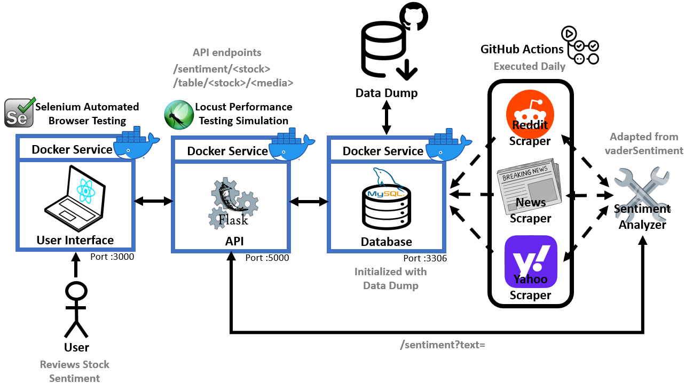

# Market Sentiment Analyzer Tool

Introducing our innovative project, a **Stock Market Sentiment Analyzer Tool**, developed by **Hugo Paré (#300173735)** and **Jayden Bergevin (#300173747)** for our Capstone project in the **SEG4910-4911 class**. The mission of the **"Sheep Indicator"** is to offer valuable insight to investors aiming to decode the market sentiments efficiently.

# Table of contents
* [Architecture](#architecture)
* [Scraping APIs](#scraping-apis)
  * [Reddit](#reddit)
  * [News](#news)
  * [Yahoo Finance](#yahoo-finance)
  * [Twitter/X](#twitterx)
* [Sentiment Anlayzer](#sentiment-analyzer)
* [Database](#database)
  * [Reddit](#reddit-1)
    * [Data Structure](#data-structure)
    * [Score Calculation](#score-calculation)
    * [Sentiment Calculation](#sentiment-calculation)
  * [News](#news-1)
    * [Data Structure](#data-structure-1)
    * [Sentiment Calculation](#sentiment-calculation-1)
    * [Weight Calculation](#weight-calculation)
* [User Interface](#user-interface)
* [Deployment](#deployment)
* [Quality Assurance](#quality-assurance)
  * [Github Actions](#github-actions)
  * [Docker](#docker)
  * [Selenium](#selenium)
* [Troubleshooting](#troubleshooting)

# Architecture

This architecture diagram provides a high-level view of how the different components in the system interact with each other. Each part of the architecture will be explained in more detail in the following sections:
* **React User Interface**: The front-end of the application is built with React, it serves as the user interface and sends requests to the Flask API
* **Flask API**: The Flask API acts as the backend, handling requests from the React UI, it processes the data, interacts with the database, and returns the sentiment of the requested company
* **MySQL Database**: All data is stored and managed in a MySQL database, the database is updated regularly by scrapers
* **News Scraper and Reddit Scraper**: These scrapers gather news and Reddit data for sentiment analysis relevant to specific stock tickers or companies, which are then stored in the database

**Architecture diagram:**


# Scraping APIs

## Reddit

The Python Reddit API used in this project was made by [PRAW](https://praw.readthedocs.io/en/stable/). It was used to scrape posts and comments from different subreddits. Posts and comments from a specific stock (example: NVDA) were scraped following this technique:

```
if a post mentions NVDA:
-> include the post
-> include all the comments associated with the post

otherwise:
-> include only comments mentioning NVDA
```

This way, only comments that are related to NVDA are taken into consideration for the sentiment analysis.

## News

The News Scraping API is constructed using data from two external APIs: [News Data](https://newsdata.io/) and [News API](https://newsapi.org/) which are combined to create our own API.

Key features include:
* Ensuring no duplicate news articles are stored
* Only news articles relevant to specific stock tickers or company names (present in the title or content) are scraped and added to the database
* The news is scraped daily, ensuring fresh and up-to-date content

This process provides a consistent, daily stream of uniuqe, company-specific news updates for further processing or display.

## Yahoo Finance

Not Implemented.

## Twitter/X

Not Implemented.

# Sentiment Analyzer

The Sentiment Analyzer used for this project was made by [vaderSentiment](https://pypi.org/project/vaderSentiment/) and modified to fit the narratives of this project. A lot of changes were made to the `vader_lexicon.txt` file to be more tailored to stock market and finance terminology, a list of those changes can be seen in the [lexicon.txt file](lexicon.txt).

# Database

The Data Base Management System (DBMS) used in this project is MySQL. The database is divided in folders, one for each stock. Each folder contains multiple tables, one for each source (i.e Reddit, News, Yahoo Finance, Twitter/X). Taking the example of NVDA:

```
NVDA tables:
  - Reddit
  - News
  - Yahoo Finance
  - Twitter/X
  - ...
```

## Reddit

The Reddit section of the database stores both posts and comments scraped from relevant subreddits. 

### Data Structure

The data is structured in the following way:

* **subreddit**: The name of the subreddit where the post or comment originated
* **post_id**: A unique identifier for the post
* **comment_id**: If the record is a comment, this column contains the unique comment ID, posts have `NULL` in this field
* **date**: The date the post or comment was created
* **score**: The score (i.e., upvotes) of the post or comment on Reddit
* **sentiment**: A sentiment score on a scale from -1 (very negative) to 1 (very positive) calculated by the Sentiment Analyzer
* **description**: The text of the post or comment

**Reddit Database (NVDA)**

|subreddit  |post_id|comment_id|date       |score|sentiment|description|
|-----------|-------|----------|-----------|-----|---------|-----------|
|stocks     |180s2lt|`NULL`    |2023-11-21 |726  |0.4588   |Nvidia crush earnings yet again|
|stocks     |1b9l1ex|ktxppxv   |2024-03-08 |1    |-0.128   |literally sold NVDA yesterday from fear of a drop. wow|
|stocks     |1b9l1ex|ktxtmyh   |2024-03-08 |3    |0.5848   |Nvda dip is rare. Buy while you can!|
|NVDA_Stock |1bcbw8h|`NULL`    |2024-03-11 |21   |0.2263   |Someone bought $780 MILLION worth of NVDA call options of Friday|

This structure helps ensure accurate tracking of both posts and their related comments, with each comment tied back to a specific post via its `post_id`. Posts themselves will always have a `NULL` value in the `comment_id` column to distinguish them from comments.

### Score Calculation

The score is the number of upvotes (or downvotes) a post or comment has received. This acts as a multiplier in determining the weight of a post's or comment's sentiment in the overall calculation. Higher-scoring posts/comments will have a larger influence on the stock's sentiment.

### Sentiment Calculation

This is a grade between -1 and 1 that represents the tone of the post or comment received by the Sentiment Analyzer. A score of -1 indicates highly negative sentiment, while 1 represents highly positive sentiment.

## News

The News section of the database stores articles scraped from external sources. 

### Data Structure

The data is structured in the following columns:
* **author**: The name of the article's author
* **content**: The main body or the article
* **date**: The date the article was published
* **sentiment**: A calculated score based on the sentiment of the article
* **title**: The headline or title of the article
* **url**: The link of the original article
* **weight**: A value representing the article's relevance and importance

**News Database (NVDA)**

|author     |content|date|sentiment       |title|url|weight|
|-----------|-------|----------|-----------|-----|---------|-----------|
|Defense World Staff     |Blue Fin Capital Inc. lifted its position in shares of...|2024-09-28    |0.471875 |Blue Fin Capital Inc. Purchases 641,575 Shares of NVIDIA Co. (NASDAQ:NVDA)  |https://www.defenseworld.net/2024/09/28/blue-fin-capital-inc-purchases-641575-shares-of-nvidia-co-nasdaqnvda.html   |40|
|null     |...|2024-10-01 |0.72428    |Analysts Go Even More Bullish As Nvidia, Meta Fly Past Buy Points  |https://www.investors.com/research/nvidia-nvda-stock-meta-stock-analysts-see-rising-profits/?src=A00220&yptr=yahoo| 2|
|newsfeedback@fool.com (Billy Duberstein)|Founded in 1993, The Motley Fool is a financial services company...|2024-10-01   |0.63364 |3 Reasons to Buy Semiconductor Stocks in October    |https://www.fool.com/investing/2024/10/01/3-reasons-to-buy-semiconductor-stocks-right-now/?source=iedfolrf0000001   |4|
|ABMN Staff |Telos Capital Management Inc. increased its stake in shares...|2024-10-01   |0.6685801 |Telos Capital Management Inc. Raises Stock Position in NVIDIA Co. (NASDAQ:NVDA)   |https://www.americanbankingnews.com/2024/10/01/telos-capital-management-inc-raises-stock-position-in-nvidia-co-nasdaqnvda.html   |80|

### Sentiment Calculation

The sentiment score is calculated by analyzing both the title and content of the article. To minimize misinterpretation from longer content that might include irrelevant details, the sentiment is weighted:
* **80%** of the sentiment is derived from the title
* **20%** comes from the content

### Weight Calculation

The weight score represents the importance of an article, starting with a default value of 1. This value is adjusted using the following multipliers:
* **Stock in title**: If the stock ticker or company name appears in the title, the article's weight is multiplied by **10x**
* **Website's reputation**: Articles from more reputable websites receive a multiplier ranging from **2x to 10x** based on their credibility
* **Author's reputation**: Articles written by reputable authors are multiplied by **2x**
* **Author not provided**: If the author's name is provided, the article's weight is multiplied by **2x**
* **Content not empty**: Articles with non-empty content are multiplied by **2x**

This weighting system helps prioritize more relevant and higher-quality articles in the database, ensuring accurate data for further analysis

# User Interface

Coming Soon.

# Deployment

This deployment diagram illustrates the following key components:
* **User Interface (React)**: A user interface built with React that communicated with the backend API
* **API (Flask)**: A Flask API that processes requests from the UI and interacts with the database
* **Database (MySQL)**: Stores the data processed by the scrapers
* **GitHub Actions**: A CI/CD pipeline responsible for running unit tests on the database and scrapers and also updating the database periodically
* **Docker Container**: The services are encapsulated within a Docker container to ensure consistent deployment across environment

**Deployment diagram:**



# Quality Assurance

Our system ensures high reliability and performance through automated testing and containerization. Below are the two key components of our QA strategy:

## Github Actions

GitHub Actions uses workflows to automatically run Unit Tests on various parts of the system. These tests ensure that all components are functioning correctly and are regularly updated. The following parts are tested periodically:
* Database (every 6 hours)
* News Scraper (daily)
* Reddit Scraper (every 6 hours)
* Sentiment analyzer (every 6 hours)

This automated process ensures that our core components maintain data integrity and provide accurate results.

## Docker

The API and MySQL Database run in a Docker container, ensuring consistent and reproducible environments across different systems. As we continue to improve our scrapers, they will be added to the containerized environment once they reach a stable and production-ready state.

## Selenium

Not implemented.

# Troubleshooting

Coming Soon.
